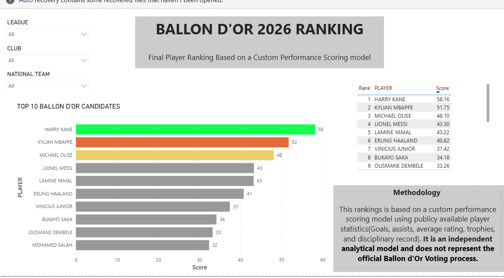

# 🏆 Ballon d'Or 2026 Analysis Dashboard
## Dashboard Preview
Bellow are the two pages of the interactive Power BI dashboard.
### Player Performance Dashboard

### Final Player Ranking

___

## Project Overview

This project is an interactive Power BI dashboard that analyzes the performance of 20 Ballon d'Or 2026 candidates using publicly available football statistics.

The goal was to build a simple, user-friendly dashboard that allows users to explore player performance through interactive filters and visualizations. Rather than overwhelming users with advanced metrics, I focused on presenting the data in a clear and accessible way so that anyone, whether they follow football closely or not, can easily understand the analysis.

> **Note:** This ranking is **not** the official FIFA or Ballon d'Or ranking. It is a personal, data-driven ranking based on a custom scoring model created for this project.

---

## Objective

The purpose of this project was to:

- Practice data cleaning and transformation.
- Build an interactive Power BI dashboard.
- Apply data visualization best practices.
- Create a custom performance ranking using football statistics.
- Present complex data in a simple and easy-to-understand format.

---

## Data

The analysis is based on publicly available player statistics from the 2025–2026 season, including:

- Goals
- Assists
- Matches played
- Club performance
- International team performance
- Disciplinary records (yellow and red cards)

---

## Custom Ranking Model

Instead of using the official Ballon d'Or voting process, this project uses a custom performance scoring model.

Each player receives a score based on a combination of individual and team performance metrics. The final ranking reflects the results of this model and is intended for analytical purposes only.

---

## Dashboard Features

- Interactive filters for:
  - League
  - Club
  - National Team
- Player performance comparisons
- Top 10 player ranking
- Performance overview
- Clean and easy-to-read visualizations

---

## Tools Used

- Power BI
- Power Query
- DAX
- Microsoft Excel

---

## Skills Demonstrated

- Data cleaning
- Data transformation
- Data modeling
- Data visualization
- Dashboard design
- Performance analysis
- Interactive reporting

---

## About the Author

Hi, I'm **Jennifer Hadisi**, an aspiring Data Analyst with a background in **Business Management** and **Aviation**. This project is part of my data analytics portfolio, where I use data analysis and visualization techniques to turn data into meaningful insights. I'm currently expanding my skills in **Power BI, Excel, SQL, Python, and data visualization**, and I'm always open to learning, feedback, and new opportunities.
Thank you for taking the time to explore this project. Feedback is always welcome!
